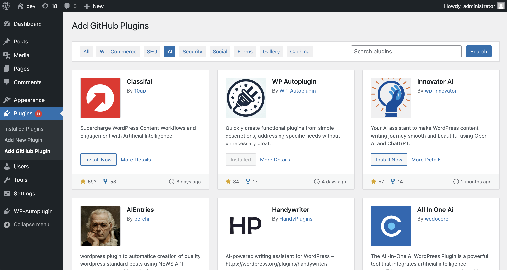
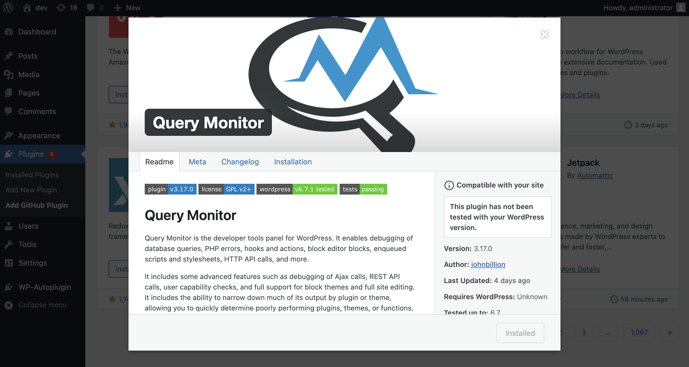
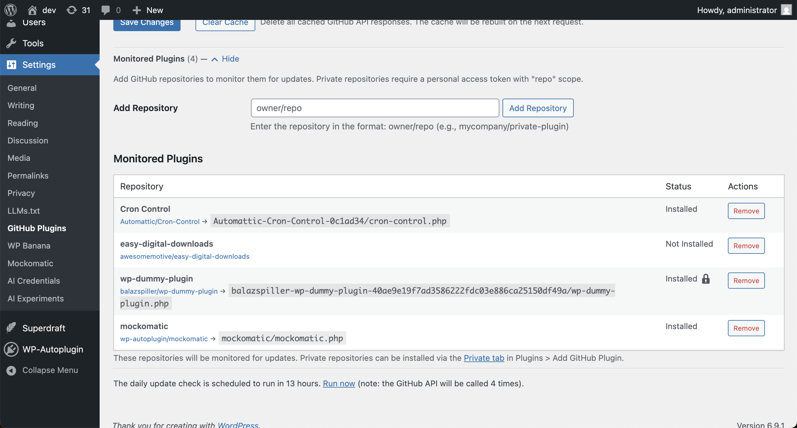
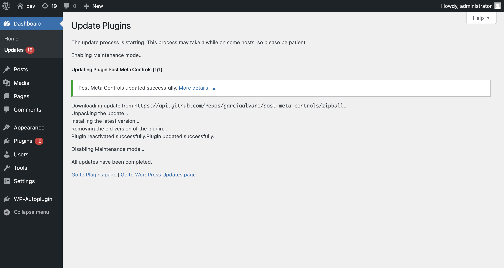

# hub2wp

hub2wp is a WordPress plugin that lets you discover, install, and update plugins hosted on GitHub directly from your WordPress dashboard. By leveraging GitHub's plugin ecosystem, it provides a straightforward way to extend your WordPress site beyond the plugins available on WordPress.org.

hub2wp does not require any changes to existing plugins or approvals from a central authority to make plugins discoverable or updatable. All it takes is for developers to add the `wordpress-plugin` tag to their public GitHub repository. hub2wp automatically verifies that a repository is a valid WordPress plugin. Thousands of valid plugins are already available on GitHub, ready to be installed right away! Private repositories are also supported, and you can manually set up update monitoring for plugins installed outside hub2wp.

Also check out the [hub2wp Plugin Repository](https://hub2wp.com/) a public website to browse, search, and explore WordPress plugins hosted on GitHub.

---

## Features

- **Search GitHub Plugins**: Browse and search repositories on GitHub to find plugins that meet your needs.
- **Install with One Click**: Easily add GitHub-hosted plugins to your site.
- **Update Management**: Receive notifications and perform updates for GitHub plugins directly from your admin panel, like you would for WordPress.org plugins.
- **Optional GitHub Token Support**: Increase the GitHub API rate limit by adding a personal access token. Normal usage does not require a token, thanks to GitHub's generous API limits for unauthenticated requests.
- **Caching**: Built-in caching minimizes API requests for faster performance and reduced API quota usage.
- **Manual Update Monitoring**: Set up update monitoring for plugins installed outside hub2wp.
- **Private Repository Support**: Browse, install, and update plugins from private GitHub repositories.

---

## How It Works

1. **Plugin Eligibility**:  
   To appear in hub2wp’s plugin list and search results, a repository must include the `wordpress-plugin` topic on GitHub. The repository must also include a `Stable tag:` header in either readme.txt or readme.md in the root folder. 

2. **Update Mechanism**:  
   Currently, hub2wp checks the `Stable tag:` version in the default branch of the repository to manage updates. In the future, support for GitHub releases will be added, prioritizing them for update monitoring if the repository uses the releases feature.

3. **Installation**:  
   - Download the latest release from the [Releases](https://github.com/WP-Autoplugin/hub2wp/releases) page.
   - Upload the ZIP file via the 'Plugins' screen in WordPress or extract it to the `/wp-content/plugins/` directory.
   - Activate hub2wp from the 'Plugins' menu.
   - Start exploring GitHub plugins under “Plugins > Add GitHub Plugin.”

4. **Configuration (Optional)**:  
   - Add a personal GitHub token in “Settings > GitHub Plugins” to increase API limits.
   - Adjust caching settings for optimized performance.

---

## Roadmap

hub2wp will continue to evolve with the following planned features:

- **Release Tracking**: Monitor GitHub releases for updates instead of just the default branch.
- **Custom Branch Monitoring**: Enable update tracking for specific branches other than the main branch.
- **Theme Support**: Expand hub2wp to also support themes hosted on GitHub.
- **Full WP-CLI Integration**: Provide WP-CLI commands for managing GitHub plugins via the command line.

---

## Screenshots

GitHub Plugin Browsing

Plugin Details Popup

Set up Update Monitoring for Plugins on the Settings Page

Update Processing via GitHub API

---

## FAQs

**Do I need a GitHub token?**  
No, but adding one increases the API request limit, which may be useful for high usage scenarios. Without a token, you can make up to 60 API requests per hour, which is sufficient for most users. You only need a token if you have a large number of plugins or if you want to use private repositories.

**Will this plugin interfere with WordPress.org plugins?**  
No, hub2wp operates independently of WordPress.org and only manages plugins sourced from GitHub.

**What happens if a plugin is updated on GitHub?**  
hub2wp will check for updates based on the `Stable tag:` version in the default branch. If a new version is detected, you will receive an update notification in your WordPress dashboard, allowing you to update the plugin directly from there.

**Can I use hub2wp for private repositories?**  
Yes, you can add private repositories to hub2wp by providing a GitHub token with the appropriate permissions. Private repositories will be listed in a separate tab in the plugin browser.

---

## Contribution

hub2wp is open source and welcomes contributions. If you encounter issues or have suggestions, please create an issue or pull request in the [GitHub repository](https://github.com/WP-Autoplugin/hub2wp).

---

## Changelog

### 1.1.0
- New: Added support for private GitHub repositories.
- New: Private repositories tab in plugin browser.
- New: Settings page UI for managing repositories / monitored plugins.

### 1.0.1
- Fix: Update plugin data saved in the activation hook.
- Fix: Use the last commit date from the default branch as the plugin's last updated date.

### 1.0.0
- Initial release
