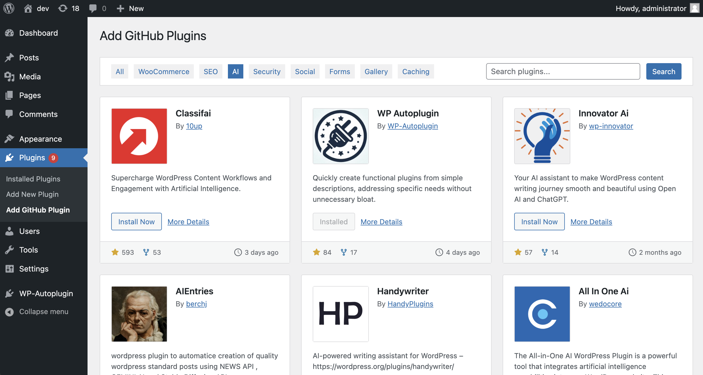
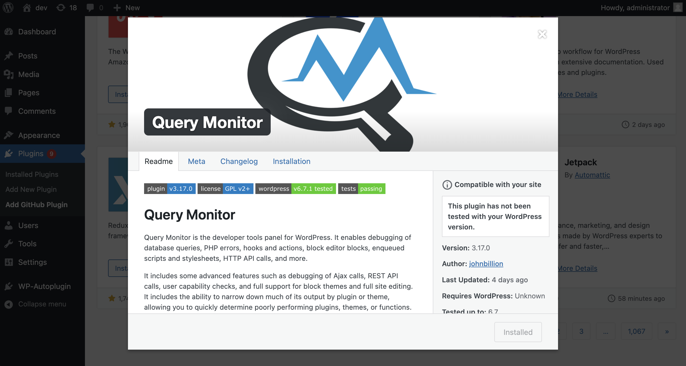
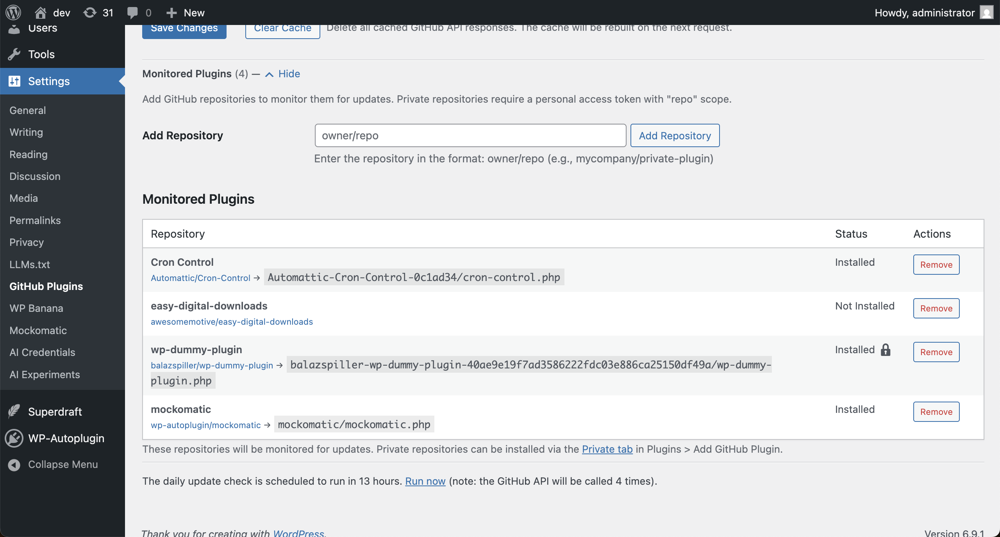
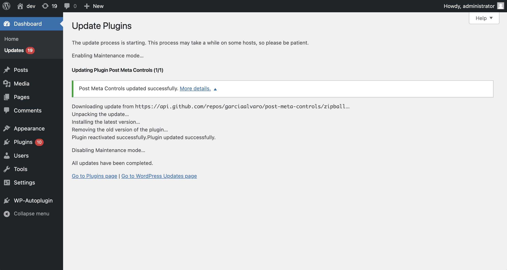

# hub2wp

hub2wp is a WordPress plugin that lets you discover, install, and update plugins and themes hosted on GitHub directly from your WordPress dashboard. By leveraging GitHub's ecosystem, it provides a straightforward way to extend your WordPress site beyond the resources available on WordPress.org.

hub2wp does not require any changes to existing plugins or approvals from a central authority to make themes and plugins discoverable or updatable. All it takes is for developers to add the `wordpress-plugin`/`wordpress-theme` tag to their public GitHub repository. hub2wp automatically verifies that a repository is a valid WordPress extension. Thousands of valid plugins and themes are already available on GitHub, ready to be installed right away!

Private repositories are also supported, and you can manually set up update monitoring for themes and plugins installed outside hub2wp.



Also check out the [hub2wp Plugin Repository](https://hub2wp.com/) a public website to browse, search, and explore WordPress plugins hosted on GitHub.

---

## Features

- **Search GitHub Plugins and Themes**: Browse and search repositories on GitHub to find plugins and themes that meet your needs.
- **Install with One Click**: Easily add GitHub-hosted plugins and themes to your site.
- **Update Management**: Receive notifications and perform updates for GitHub plugins and themes directly from your admin panel, like you would for WordPress.org plugins.
- **Optional GitHub Token Support**: Increase the GitHub API rate limit by adding a personal access token. Normal usage does not require a token, thanks to GitHub's generous API limits for unauthenticated requests.
- **Caching**: Built-in caching minimizes API requests for faster performance and reduced API quota usage.
- **Manual Update Monitoring**: Set up update monitoring for plugins and themes installed outside hub2wp.
- **Private Repository Support**: Browse, install, and update plugins and themes from private GitHub repositories.
- **Release-Based Updates**: When a repository has GitHub releases, hub2wp uses the latest release tag for version checks and downloads. This behavior can be disabled in settings to fall back to branch-based checking.
- **Custom Branch Tracking**: Track a specific branch for updates instead of the repository's default branch.

---

## How It Works

1. **Plugin and Theme Eligibility**:
   To appear in hub2wp, a repository must have the `wordpress-plugin` or `wordpress-theme` GitHub topic. Plugins also need a `Stable tag:` header in their `readme.txt` or `readme.md`, and themes need a `Version:` header in `style.css`. These version headers are used for update monitoring.

2. **Update Mechanism**:
   hub2wp checks for updates using a two-step priority system. First, if the repository has GitHub releases, it uses the **latest release tag** to determine the current version and downloads the release archive. If no releases exist — or if release-based checking is disabled in "Settings > GitHub Plugins" — it falls back to reading the `Stable tag:` or `Version:` header from the tracked branch (the repository's default branch, or a custom branch you configure). When a new version is detected, you will receive an update notification in your WordPress dashboard, allowing you to update the plugin or theme directly from there.

3. **Installation**:
   - Install the latest GitHub release with WP-CLI:

     ```bash
     wp plugin install "https://github.com/WP-Autoplugin/hub2wp/archive/refs/tags/$(curl -fsSL https://api.github.com/repos/WP-Autoplugin/hub2wp/releases/latest | php -r '$release = json_decode(stream_get_contents(STDIN), true); echo $release[\"tag_name\"];').zip" --activate
     ```

   - Or download the latest release from the [Releases](https://github.com/WP-Autoplugin/hub2wp/releases) page and upload the ZIP file via the 'Plugins' screen in WordPress or extract it to the `/wp-content/plugins/` directory.
   - Activate hub2wp from the 'Plugins' menu.
   - Start exploring GitHub plugins under "Plugins > Add GitHub Plugin". Browse themes by clicking on the "GitHub Themes" button under "Appearance > Themes".

4. **Configuration (Optional)**:
   - Add a personal GitHub token in “Settings > GitHub Plugins” to increase API limits and access private repositories.
   - Adjust caching settings for optimized performance.
   - Set up update monitoring for manually installed plugins and themes.

---

## Screenshots

<details>
<summary>GitHub Plugin Browsing</summary>


</details>

<details>
<summary>Plugin Details Popup</summary>



</details>

<details>
<summary>Set up Update Monitoring for Plugins on the Settings Page</summary>



</details>

<details>
<summary>Update Processing via GitHub API</summary>



</details>

---

## FAQs

**Do I need a GitHub token?**  
No, but adding one increases the API request limit, which may be useful for high usage scenarios. Without a token, you can make up to 60 API requests per hour, which is sufficient for most users. You only need a token if you have a large number of plugins or if you want to use private repositories.

**Will this plugin interfere with WordPress.org plugins?**  
No, hub2wp operates independently of WordPress.org and only manages plugins sourced from GitHub.

**What happens if a plugin is updated on GitHub?**  
hub2wp will first check the repository's latest GitHub release for a new version. If the repository has no releases (or you have disabled release-based checking in settings), it falls back to reading the `Stable tag:` version from the tracked branch. Either way, when a new version is detected you will receive an update notification in your WordPress dashboard.

**Can I use hub2wp for private repositories?**  
Yes, you can add private repositories to hub2wp by providing a GitHub token with the appropriate permissions. Private repositories will be listed in a separate tab in the plugin browser.

---

## Developer-Friendly

hub2wp is designed to be useful for site builders and developers, not just end users. It supports private repositories, custom tracked branches, and release-priority update checking. It also exposes filters so projects can adapt hub2wp to their own workflow without forking the plugin.

### WP-CLI

hub2wp now ships with tracked GitHub install commands for plugins and themes:

```bash
wp hub2wp plugin install owner/repo --activate
wp hub2wp plugin list
wp hub2wp theme install owner/repo --activate
wp hub2wp theme list
```

Useful flags:

- `--branch=<branch>` to track a specific branch.
- `--no-release-priority` to force branch-based tracking even if releases exist.
- `--token=<token>` to install from a private repository or override the stored hub2wp token for this run.

These commands install the extension from GitHub and immediately register it in hub2wp's monitored plugins or monitored themes list so update checks behave the same as installs started from the hub2wp UI.
The `list` commands show the tracked plugin or theme name, GitHub repository, and local directory/slug.

You can also manage hub2wp settings from WP-CLI:

```bash
wp hub2wp settings set access_token ghp_xxx
wp hub2wp settings set cache_duration 6
wp hub2wp settings get access_token
wp hub2wp settings list
```

### Filters

Current custom filters:

- **`hub2wp_repo_tracking_preferences`**: Override the effective tracked branch and `prioritize_releases` setting for one repository.
- **`hub2wp_github_request_args`**: Adjust request arguments before a GitHub API request is sent. Useful for timeouts, custom headers, or enterprise/proxy integrations.
- **`hub2wp_install_source_context`**: Override the resolved source context after hub2wp decides between branch-based and release-based tracking.
- **`hub2wp_compatibility_result`**: Adjust the final compatibility result after plugin/theme headers have been parsed.

Example:

```php
add_filter( 'hub2wp_repo_tracking_preferences', function( $preferences, $owner, $repo, $repo_type, $repo_data ) {
	if ( 'acme' === $owner && 'my-plugin' === $repo ) {
		$preferences['branch'] = 'develop';
		$preferences['prioritize_releases'] = false;
	}

	return $preferences;
}, 10, 5 );

add_filter( 'hub2wp_github_request_args', function( $args, $url, $github_api ) {
	$args['timeout'] = 20;
	return $args;
}, 10, 3 );

add_filter( 'hub2wp_install_source_context', function( $context, $owner, $repo, $github_api ) {
	if ( 'acme' === $owner && 'my-plugin' === $repo ) {
		$context['source'] = 'branch';
		$context['uses_releases'] = false;
		$context['ref'] = 'develop';
		$context['download_url'] = $github_api->get_download_url( $owner, $repo, 'develop' );
	}

	return $context;
}, 10, 4 );

add_filter( 'hub2wp_compatibility_result', function( $compatibility, $headers, $owner, $repo, $repo_type, $source_context, $github_api ) {
	if ( 'acme' === $owner && 'legacy-plugin' === $repo ) {
		$compatibility['is_compatible'] = true;
		$compatibility['reason'] = '';
	}

	return $compatibility;
}, 10, 7 );
```

---

## Agentic Workflows

hub2wp is designed to be fully operable by AI agents and automated systems without any manual UI interaction. It exposes three complementary interfaces that agents can use to install, inspect, and maintain GitHub-hosted WordPress plugins and themes.

The preferred interface order is:
1. **WP-CLI** for routine local administration.
2. **Abilities API** for structured PHP or REST execution on WordPress 6.9+.
3. **Admin UI** for interactive browsing or dashboard-specific tasks only.

### WP-CLI

Every hub2wp operation is available as a WP-CLI command, making the plugin fully scriptable. See the [WP-CLI](#wp-cli) commands in the Developer-Friendly section above for the complete command reference. Agents should prefer hub2wp's own install commands over raw `wp plugin install` or `wp theme install` so that update tracking is set up automatically alongside the installation.

### Abilities API

On WordPress 6.9 and later, hub2wp registers structured abilities through the WordPress Abilities API. Abilities provide typed input/output schemas that make hub2wp's functionality easy to call from PHP code, other plugins, or the REST API.

Two categories are registered:

- **`hub2wp-discovery`** – Read-only abilities for inspecting repositories and tracked items. These are also exposed via the REST API under `/wp-json/wp-abilities/v1`.
- **`hub2wp-management`** – Mutating abilities for installing extensions, clearing the cache, and running update checks. Available in PHP only.

| Ability | Category | REST |
|---|---|---|
| `hub2wp/list-tracked-plugins` | discovery | ✓ |
| `hub2wp/list-tracked-themes` | discovery | ✓ |
| `hub2wp/get-repository-details` | discovery | ✓ |
| `hub2wp/check-repository-compatibility` | discovery | ✓ |
| `hub2wp/install-plugin-from-github` | management | – |
| `hub2wp/install-theme-from-github` | management | – |
| `hub2wp/clear-cache` | management | – |
| `hub2wp/run-update-check` | management | – |

### Skill for AI Agents

hub2wp ships with a structured **skill** at `skills/hub2wp/` that AI coding assistants and autonomous agents can load to understand how to operate the plugin correctly. Any agent that loads this skill will know to prefer hub2wp's own commands for GitHub packages over raw WordPress installs, preserve update-tracking semantics, and avoid exposing GitHub tokens in outputs.

The skill includes:

- **`SKILL.md`** – A concise instruction file describing the preferred interface order, environment verification steps, and guardrails for handling secrets and troubleshooting.
- **`references/operations.md`** – A complete command-and-ability reference with copy-paste examples for every WP-CLI command, PHP ability invocation, and REST endpoint.
- **`agents/openai.yaml`** – An OpenAI-compatible agent definition for structured tool-use integrations.

---

## Contribution

hub2wp is open source and welcomes contributions. If you encounter issues or have suggestions, please create an issue or pull request in the [GitHub repository](https://github.com/WP-Autoplugin/hub2wp).

---

## Changelog

See [readme.txt](readme.txt) for the full changelog.
